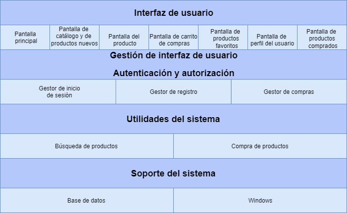

# Arquitectura.
 

La arquitectura que utilizaremos es la arquitectura genérica de capas, ya que es la arquitectura recomendada para aplicaciones web de comercio electrónico. Nuestra arquitectura queda de la siguiente manera: 

 

