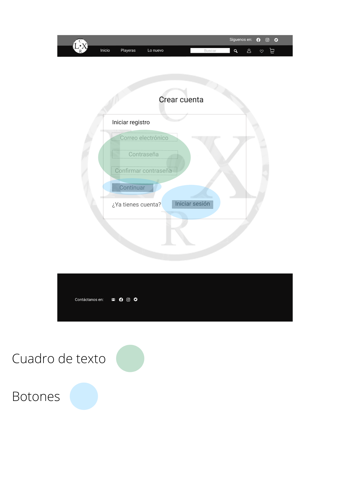

# Interfaz 
 

Este es el nuevo prototipo, fue expuesto al cliente y fue aprovado por él. Solo que nos vimos a la necesidad de cambiar de aplicación de desarrollo para el prototipo, ya que encontramos que era más fácil y gratis, la cual es "Figma".

Teniendo como resultado el siguiente nuevo prototipo de Página principal, el cual ya había sido aprobado por el cliente. También le mostramos los requerimientos que fuimos contruyendo, y una vez validados obtuvimos los requerimientos finales, los cuales se pueden consultar en la pestaña de **Requerimientos**.

También fuimos consultando con el cliente otras pantallas que se iban a ocupar las cuales se muestran a continuación:

Pantalla de "Crear Cuenta"

 

Pantalla de "Inicio de sesión"

 

Pantalla de "Catálogo"

 

Pantalla de "Palyera Información"

 

Pantalla de "Carrito"

 

# Elementos que conforman a la página principal

 

# Elementos que conforman a la página de Crear Cuenta

 

# Elementos que conforman a la página de Catálogo

 

# Elementos que conforman a la página de Playeras información

 

# Elementos que conforman a la página de Carrito de compras

