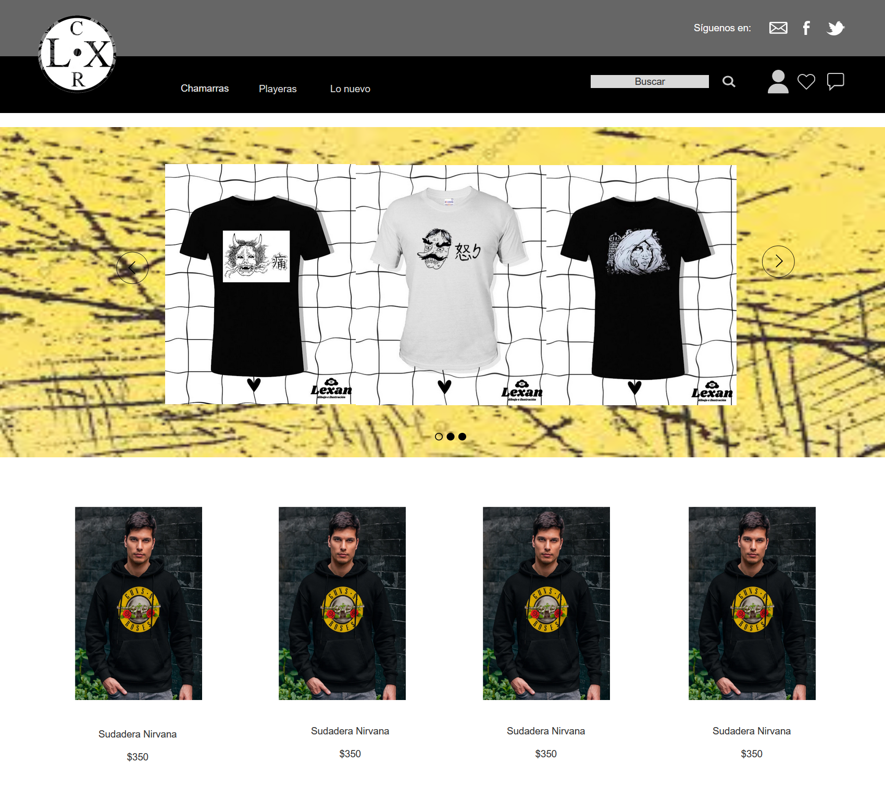
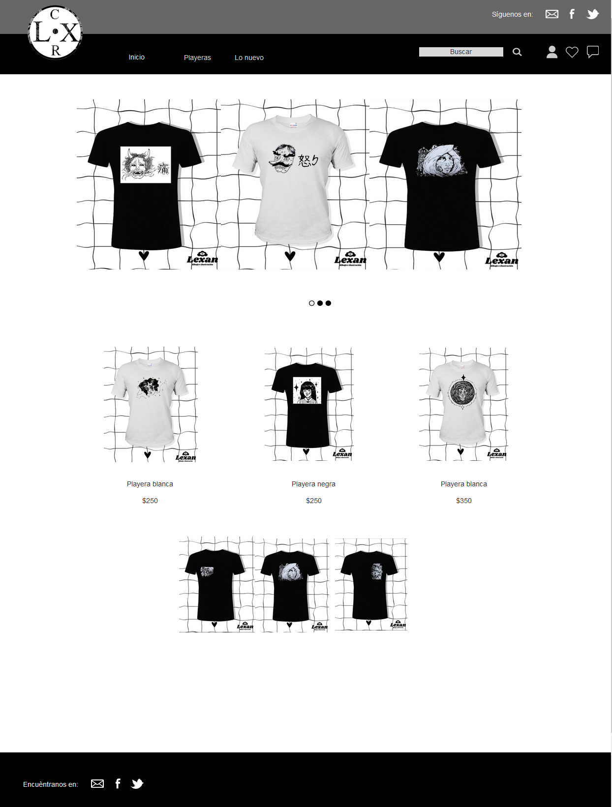

# Elicitación o extracción:
 

# 1) Obtención de información sobre el dominio del problema y el sistema actual
 

Para obtener información sobre el dominio del problema y el sistema actual visitamos distintas páginas web dedicadas a la venta de ropa recomendadas por el cliente y otras conocidas por nosotros. 

Las cuales fueron:

| Recomendadas por el cliente | Conocidas por nosotros |
|-----------------------------|------------------------|
|<a href="https://www.obzeno.com/" target="_blank">https://www.obzeno.com/</a>| <a href="https://www.bershka.com/mx/mujer-c1010193132.html" target="_blank">https://www.bershka.com/mx/mujer-c1010193132.html</a>           |
|<a href="https://www.distopiaclothing.com/" target="_blank">https://www.distopiaclothing.com/</a>| <a href="https://toxic.mx/" target="_blank">https://toxic.mx/</a>               |  

De todas estas páginas web extrajimos infromación como las páginas que debe haber, como suelen estar distribuidas, los elementos que contienen e inspiración sobre los colores o estilos.

De estas páginas obtuvimos los requerimientos que se muestran en la pestaña de **Requerimientos**.

 

# 2) Preparación y realización de las reuniones de elicitación/negociación.

Realizamos una entrevista online de la cual hicimos algunas anotaciones, las cuales fueron:

* Debe ser una página con estilo *"Darks y urbano"*. 
* Debe tener una página principal donde se exiban algunos productos.
* Debe haber links a redes sociales.
* Debe tener un catálogo de productos.

Con esta información y con nuestras referencias de páginas web creamos el siguiente primer prototipo:

Después de esto, realizamos una segunda entrevista en la cual se le expuso al cliente el primer prototipo, del cual el cliente nos brindó algunas observaciones y correciones. Además obtuvimos nuevas anotaciones, las cuales fueron:

* Nos sugirió inspirarnos en las páginas web que nos brindó, las cuales fueron anteriormente mencionadas. 
* La paleta de colores debe ser de tonalidades obscuras.
* Debe tener una marca de agua del logo al fondo.

Con esta nueva información realizamos un nuevo prototipo, el cual se muestra a continuación:

Este nuevo prototipo fue expuesto al cliente y fue aprovado por él. Solo que nos vimos a la necesidad de cambiar de aplicación de desarrollo para el prototipo, ya que encontramos que era más fácil y gratis, la cual es "Figma".

Teniendo como resultado el siguiente nuevo prototipo de Página principal, el cual ya había sido aprobado por el cliente. También le mostramos los requerimientos que fuimos contruyendo, y una vez validados obtuvimos los requerimientos finales, los cuales se pueden consultar en la pestaña de **Requerimientos**.

También fuimos consultando con el cliente otras pantallas que se iban a ocupar las cuales se muestran a continuación:

Pantalla de "Crear Cuenta"

 

Pantalla de "Inicio de sesión"

 

Pantalla de "Catálogo"

 

Pantalla de "Palyera Información"

 

Pantalla de "Carrito"

