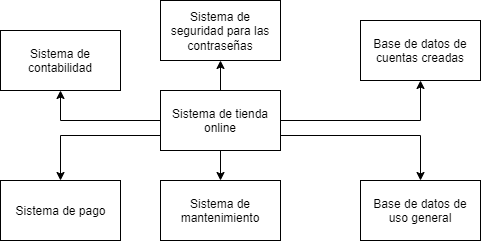
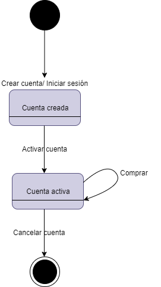

# Modelos de Software
Ocuparemos el modelado, ya que nos permite visualizar de mejor manera los requisitos, la estructura y el comportamiento que tendrá el sistema. 

En este caso ocupraemos el modelado de Contexto, el cual queda de la siguiente manera:

La siguiente figura ilustra un ejemplo de Diagrama de Transición de Estados de una cuenta de usuario para la página web. Primero se crea y se encuentra en estado "Cuenta creada", al activarla pasa al estado "Cuenta Activa", mientras esté en este estado se pueden realizar compras de los productos, el diagrama termina cuando se cancela la cuenta.

